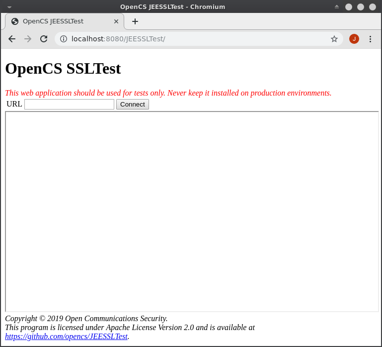

# OpenCS's JEESSLTest

## Description

**OpenCS's JEESSLTest** is a small **Java EE 4+** web application designed to be
used to test HTTP and HTTPS connections from withing a **Java EE Application Server**.

It is specially useful to test connections in environments under heavy firewall
protection and/or the use of intranet certificate chains.

## How to build it

The web application can be built by using **Apache Maven**, a compatible JDK and
a Internet connection to get compile time dependencies (Java EE 5 API).

Just run **mvn install** on the source directory and wait for it to end. The
**war** package will be found inside the directory **target**.

## How to use it

Just deploy it on the target application server and access the published URL with
any web browser.

To test the connection, just put the target URL in the URL text box and press
**Connect**. The result of the connection will be display right bellow.



A short demonstration video can be found at https://youtu.be/TSvAAN8KKik (needs update).

It also have a small console tool called **JSESSLTest** that can be executed directly by
running:

```
$ /path/to/java/bin/java -jar JSESSLTest-x.y.z-SNAPSHOT.jar
```

## Compatibility

This application was designed to be used with any **Java EE 5+** application server
running on Java 1.5 or later. 

This is the compatibility matrix with tested application servers:

 Application Server | JDK | Result | Reported by
 ------------------ | --- | ------ | -----------
 Apache TomEE 7.1 | OpenJDK 8u212-b03 | OK | OpenCS
 IBM WAS 6.1 | Built-in J9 | OK | OpenCS
 IBM WAS 8.5.5.x | Built-in J9 | ? | OpenCS
 IBM WAS 9.0.x | Built-in J9 | ? | OpenCS
 RedHat JBoss 5.1 | Sun Microsystems JDK 1.5.0_22 | OK | OpenCS

## Licensing

This software is released under Apache License Version 2.0.

## Contributions

We are open to contributions from anyone. You can propose enhancements, report bugs and/or
contribute with code using GitHub. Just keep in mind that the main objective of this
project is to remain as simple and as compatible as possible.

If you want to report compatiblity with other application servers, feel free to
contact us. All contributions will be properly credited.
